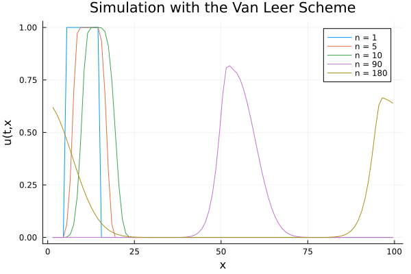
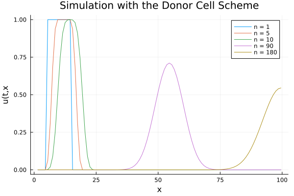
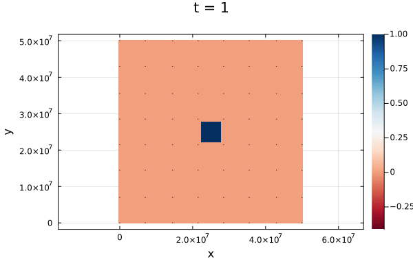

# NumericalMeteorology
Repository for Numerical Meteorology at Leipzig University
o


# NumericalMeteorology

Repository for the student Project in Numerical Meteorology at Leipzig University

This repository contains Julia scripts and supporting files for 
conducting numerical simulations in meteorology. The primary script, main.jl, orchestrates the execution of various models and generates visual outputs.

## Project Overview / Summary

The NumericalMeteorology repository provides the code and tex source for the
student project. The goal of this project was to compare different methods for the
linear advection equation and the shallow water equation using Julia. For the advection
equation it implements:

- Donor Cell Scheme / Upwind Scheme
- Method of Lines with RK4 time integration
- Leapfrog time integration using centered differences
- Lax-Wendroff Method
- van Leer Scheme / MUSCL scheme


## Installation & Dependencies
System Requirements

Operating System: Linux with Bash support

### Software Requirements

Julia: A high-level, high-performance programming language for technical computing.

Bash: A Unix shell and command language.


Install the necessary Julia packages by running the following commands in the Julia REPL:
```julia
using Pkg
Pkg.add("Plots")
Pkg.add("PrettyTables")
```

## Usage
To run the entire project, just execute the following command in your local directory:
```bash
julia main.jl
```

## Examples

### Linear Advection Equation



## Shallow Water Equation in 2D

